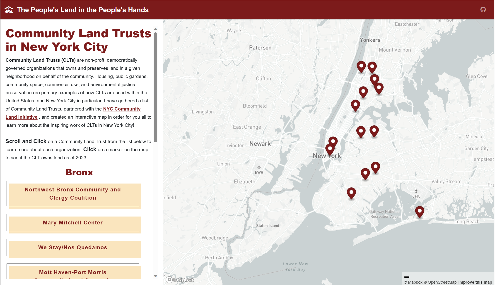

# Community Land Trusts in NYC

# About

This web map is created to expand the discussion of Community Land Trusts (CLTs) in New York City. Specifically, it is to curate an interactive map of land trusts partnered with the <a href='https://nyccli.org/'>NYC
                      Community Land
                      Initiative</a>. 

When researching community land trusts, geographic locations of CLTs in the City are often represented on a <a href='https://nyccli.files.wordpress.com/2023/05/clt_map_nyccli_may2023.jpg'>static map</a>. Given this, I wanted to combine the thorough research and storytelling of each CLT organization along with the land trusts geographical location so that viewers may find out more about the movement and if there are any CLTs close by.

# Methodology

I gathered various land trusts via the NYC Community Land Initiative’s <a href='https://nyccli.org/about/members-and-endorsers/'>members and endorsers</a>. While not every CLT is represented here given difficulty verifying information of the trust along with geographic location, the interactive map provided represented a significant portion of the CLTs in New York City. 

I compiled my list of CLTs along with each address manually via the CLTs’ websites. I then exported the .CSV to <a href='https://dash.geocod.io/'>Geocodio</a> to retrieve the longitude and latitude for each location. The new .CSV was then converted to a.json file and uploaded to my project. I utilized the HTML, JavaSctript, and CSS to then create the map utilizing various styling tools, which are accessible via my Github. 

For research, I also utilized the various CLTs’ websites, which are linked within the interactive map, along with the Pratt Center for Community Development’s "<a href='https://prattcenter.net/uploads/0423/1682705700812033/Pratt_Center_Gaining_Ground-042823.pdf'>CLTs Gaining Ground in NYC</a>.”

This list is not comprehensive, nor is my description of each CLT. Rather it is a starting point to further the data storytelling of the grassroots organizing efforts of Community Land Trusts in NYC. Any ideas to improve the map are more than welcome!